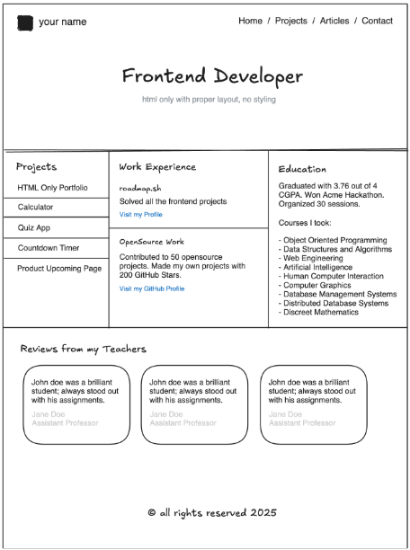

# 📄 CV

> **Nota:** El documento HTML usa estilos CSS en su estructura.

## 📌 Solución al reto de Roadmap.sh

🔗 [Página del reto](https://roadmap.sh/projects/single-page-cv)
🔗 [reto2](https://roadmap.sh/projects/basic-html-website)

## 📌 Repositorio del proyecto

- 🔗 [Repositorio en GitHub](https://github.com/raulmoto/roadmap.sh-solutions)
- 🔗 [Basic Web Site](https://github.com/raulmoto/roadmap.sh-solutions/tree/main/basicHtmlEbsite)

---

## 🔽 Descargar el proyecto en tu equipo

Asegúrate de tener instalado **Git Bash**, luego abre la terminal y ejecuta:

```bash
git clone [url de este repositorio]
```

Esto descargará el repositorio completo en tu equipo. También puedes copiar los archivos manualmente, aunque es un proceso más lento.

---

## 🌍 Vista previa del proyecto


<div align="center" style="display: flex; gap: 20px;">
  <a href="https://raulmoto.github.io/roadmap.sh-solutions/">
    
  </a>
  <a href="https://raulmoto.github.io/roadmap.sh-solutions/basicHtmlEbsite/">
    
  </a>
  <a href="https://raulmoto.github.io/roadmap.sh-solutions/basicHtmlEbsite/">
    
  </a>
</div>

---
