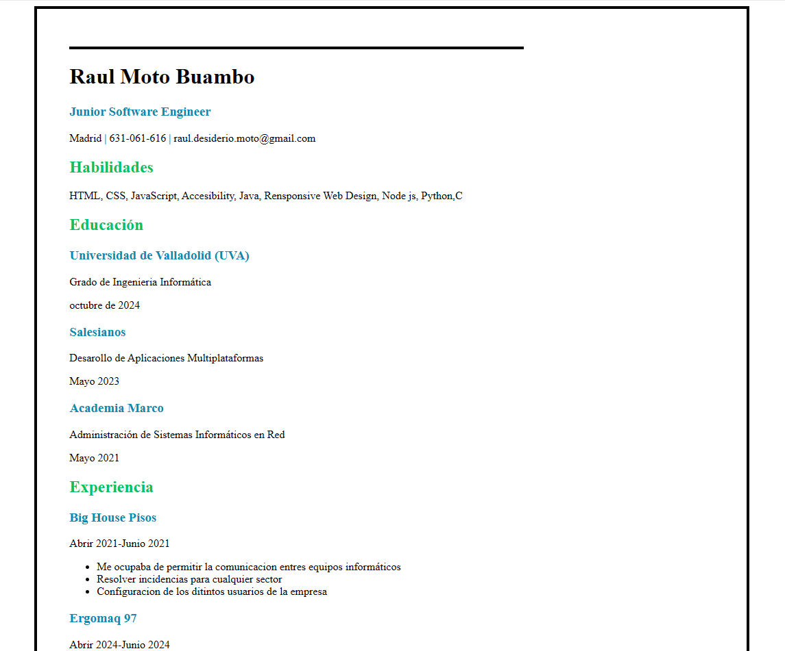

#CV
> [!NOTE]
> El doc html usa estilo css en su estructurall

## 📌 Solución al reto de Roadmap.sh

## 📌 Solución al reto de Roadmap.sh

Repositorio del proyecto:  
🔗 [project URL](https://github.com/raulmoto/roadmap.sh-solutions)


### Descargar el proyecto en mi equipo
```bash
git clone [url de este repositorio]
```
<p>
	Si desea desgaragra el proyecto en su repositorio, asegurate primero de tener instalado git bash, abra su terminas bash y ejecute
	lo siguiente.
</p>

<p>
	Con esto, se te decargará en el directorio, el respositorio entero. O simplemente puedes copiar los archivos uno a uno haciendo 
	aun  mas lento el proceso.
</p>
</p>
<p align="left">
  <a href='[index.html](https://raulmoto.github.io/roadmap.sh-solutions/)'>
    
  </a>
</p>
